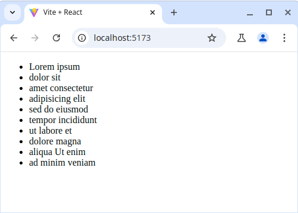

# Task 1

This exercise is about practicing fetching data and `useEffect`.

Examine the existing code in this folder and note the `data.json`. Because `data.json` is in the `public` folder, it is accessible via the browser at http://localhost:5173/data.json

## Requirements

- Print "App first render" in the console when the `App` component first renders
- Print "App data state updated" in the console when the `data` state is updated
- Fetch `data.json` and display it in the `App` component

