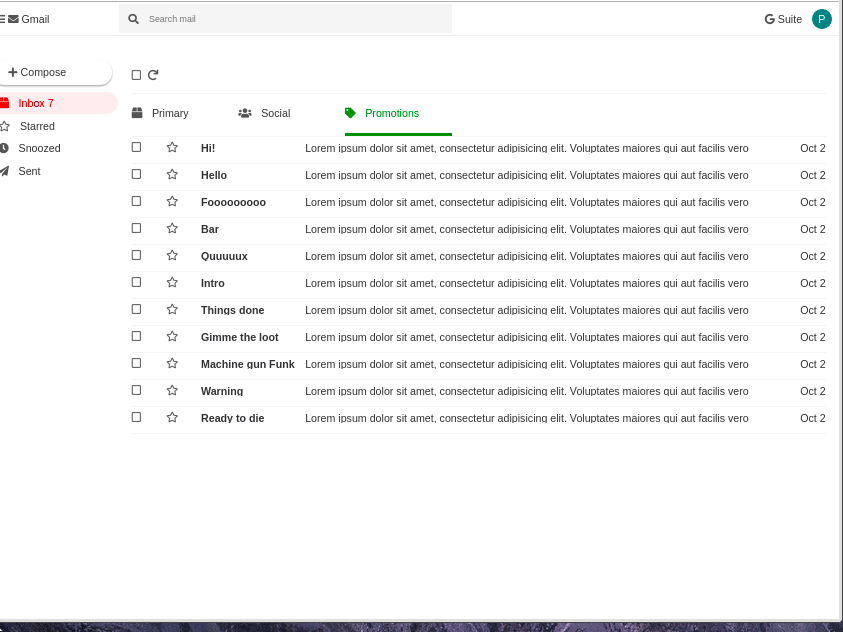

# Task 1

This exercise is about practicing styling a React app with CSS Modules, problem solving and long term focus.

You are provided with a starter React app in the [mail](./mail) folder.

Your task is to recreate the a web email client using CSS Modules for all styling:

**Note!** This is intentionally a very, very large and complex design. You are not expected to finish everything in one day. The goal is to practice using CSS Modules and to get as close as far as you can. Keep working on it and working through any problems you encounter, this is very good experience!
